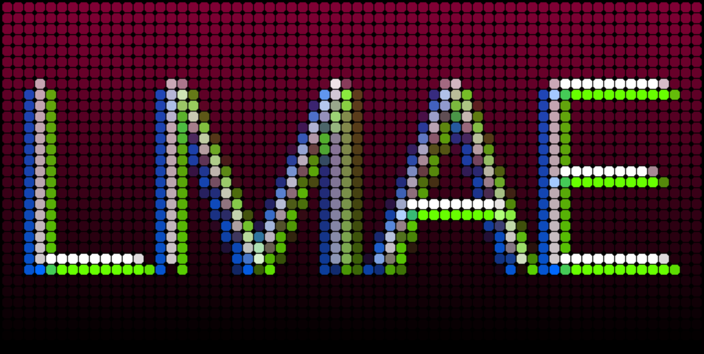
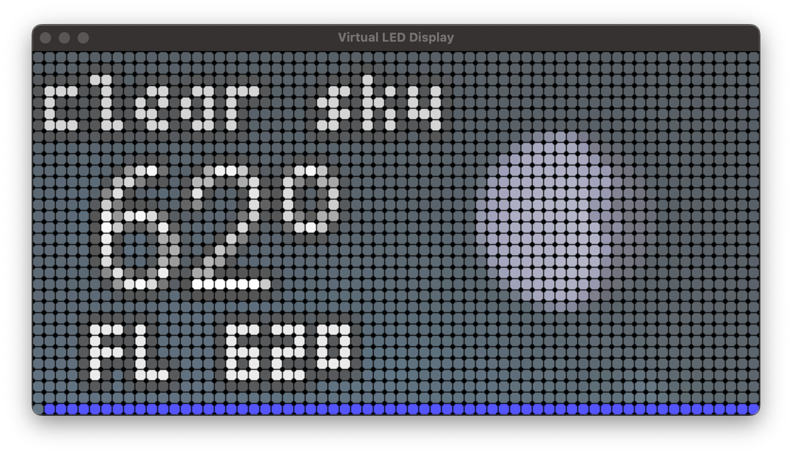

# LMAE - LED Matrix Animation Engine for RPi and Python

<!--suppress CheckImageSize -->

A library for building little applications  that can run on a Raspberry Pi and
display interesting things on a LED matrix.
The matrix I have is from Adafruit and it is
[64 x 32, 3mm pitch](https://www.adafruit.com/product/2279).
I am driving it with a Raspberry Pi 3B and a [matrix bonnet](https://www.adafruit.com/product/3211).

## Table of Contents
<!-- TOC -->
* [LMAE - LED Matrix Animation Engine for RPi and Python](#lmae---led-matrix-animation-engine-for-rpi-and-python)
  * [Table of Contents](#table-of-contents)
  * [LMAE Basics](#lmae-basics)
    * [Prerequisites](#prerequisites)
    * [Getting started](#getting-started)
    * [Library structure](#library-structure)
* [Weather app](#weather-app)
    * [OpenWeather API bookmarks](#openweather-api-bookmarks)
    * [Visual crossings bookmarks](#visual-crossings-bookmarks)
* [Creating new apps](#creating-new-apps)
  * [Important classes](#important-classes)
      * [Core classes](#core-classes)
      * [Actor classes](#actor-classes)
      * [Animation classes](#animation-classes)
      * [Component classes](#component-classes)
  * [App framework](#app-framework)
  * [Virtual LED Display](#virtual-led-display)
<!-- TOC -->

## LMAE Basics

### Prerequisites

This library is built on top of the RGB LED display driver
written by Henner Zeller, found here: [hzeller/rpi-rgb-led-matrix](https://github.com/hzeller/rpi-rgb-led-matrix)
You'll need to build that first, as this library depends on it for access to the LED matrix.
In particular, you need to `make install` the python 3 bindings to get all of the needed binaries,
which are not included in this project.

On my Pi with the latest version of the library, I also had to follow the guidance to
switch off on-board sound (`dtparam=audio=off` in `/boot/config.txt`)
and blacklist the `snd_bcm2835` kernel module by adding a file `/etc/modprobe.d/blacklist-rgb-matrix.conf`
with the following contents:

    blacklist snd_bcm2835

The alternative, if you don't want to do this, is to disable hardware pin-pulse generation with the command line
option `--led-no-hardware-pulse 1`. This will also let you avoid having to run with `sudo`. See below for more details.

### Getting started
`render_test.py` is an example program that test the basics of the core
library. You should create a virtual environment using `venv`:

    python -m venv venv

Activate your environment:

    source venv/bin/activate

Install the required libraries:

    pip install -r requirements.txt

Set an environment variable that contains the path to the python binding directory in `rpi-rgb-led-matrix`,
something like:

    export RGB_MATRIX_PY_PATH=~/rpi-rgb-led-matrix/bindings/python

Run the first example in a virtual LED window:

    python render_test.py -v

If all is successful, you will see a surprise animation demo!
Press "return" on the app console to end the test. To run on the Raspberry Pi
with the real LED matrix hardware:

    sudo -E venv/bin/python render_test.py

The `sudo` is necessary to allow the LED matrix code to run with
the elevated privileges necessary to achieve best GPIO timing performance.
And because `sudo` doesn't use the user's path, the usual means to activating
the virtual environment doesn't work. If you don't like taking the risk of sharing
all your environment variables with the `root` account, you can set the environment
variable in the `sudo` command, like:

    sudo RGB_MATRIX_PY_PATH=/home/myuser/rpi-rgb-led-matrix/bindings/python venv/bin/python render_test.py

*IDE Note:*  In order to get your IDE to find the `rgbmatrix` module so all your syntax highlighting
will be nice and clean, you'll need to add the python bindings path (the same as what you set in the
`RGB_MATRIX_PY_PATH` variable above) to your IDE's Python sys.path or PYTHONPATH settings.

Instructions for JetBrains IDEs can be found [here](https://www.jetbrains.com/help/idea/installing-uninstalling-and-reloading-interpreter-paths.html).

### Library structure

The core of the library are classes for basic elements
that you might find in a game engine:
there is a stage and there are actors on the stage,
and animations that modify those actors. To display a scene,
you create a stage, attach a matrix object to it, and
tell it to render a frame.

Actors can decide how to render themselves on the stage.
Some basic actors are provided for still images, moving images, and text rendering.
Actors generally are expected to know their size and position, their current
visibility, whether or not they have been modified in any way that would change
the rendering outcome.  On a stage, actors are rendered in the order that they appear
in the actor list, so the first actor has bottom Z order, the last actor has top Z order,
and so on for the actors in between.

Composite actors are actors that modify the rendering behavior of other actors.
For example, a crop actor limits the rendered visibility of an actor to a rectangular window.

Animations are instructions for modifying an actor – so far,
mainly for changing its position via movement over time.
Animations are designed to be independent of frame rate, so they have a
duration and a destination, and will get there whether that renders in 10
frames or 100 frames.

To make animations happen, they are assigned to an actor and added to the stage,
where they take effect immediately upon the next rendering of the stage.
Animations may be set to repeat once completed.
If they are not set to repeat, they are removed from the stage on completion.

Components are actors that know how to generate their own animations.
This is meant to encapsulate complex animation behavior.

The "module" module, along with the app runner module, provide tools for the
construction and execution of apps.

# Weather app

The first app is a weather conditions display app.
It relies on the [OpenWeather One Call API](https://openweathermap.org/api/one-call-api)
to get current weather conditions for a given latitude & longitude.

You need to set the following environment variables:

* `OW_API_KEY` - Your OpenWeather API key
* `LATITUDE` - The latitude of the location for which you wish to get weather conditions
* `LONGITUDE` - The longitude of the location for which you wish to get weather conditions
* `REFRESH_TIME` - Optionally, the number of seconds between refreshing weather data.
    Defaults to 600 seconds, which is the suggested shortest refresh time in the OpenWeather API documentation.

Alternatively, you could create an `env.ini` file in this directory with the following structure:

    [location]
    latitude=XXX.XXXXXX
    longitude=YYY.YYYYYY

    [openweather]
    ow_api_key=0123456789abcdef0123456789abcdef

To run the weather app on a virtual LED display in your venv-activated developtment environment:

    python weather_app.py -v

If successful, you should see something like the following, depending on current conditions:

To run it on the real LED display:

    sudo venv/bin/python weather_app.py

--------
A previous iteration of the weather app used the Visual Crossing API, and the VX API client
module remains in case anyone wants to use it.  There's also a weather.gov client, though
it doesn't furnish current conditions, only forecast predictions.

### OpenWeather API bookmarks

* [List of weather condition codes](https://openweathermap.org/weather-conditions)

### Visual crossings bookmarks
* [Weather data API Documentation](https://www.visualcrossing.com/resources/documentation/weather-api/timeline-weather-api/)
* [ Weather Data Services and URL Builder](https://www.visualcrossing.com/weather/weather-data-services)
* [Weather Condition Translations and ID list](https://docs.google.com/spreadsheets/d/1cc-jQIap7ZToVaEgiXEk_Aa6YVYjSObLV9PMe4oHrFg/edit#gid=1769797687)

# Creating new apps

## Important classes

#### Core classes
Important `lmae_core` classes include:

* `LMAEObject` - the parent of all other library classes
* `Canvas` - onto this actors draw themselves
* `Actor` - an entity that can draw itself and that is positioned on a stage
* `CompositeActor` - an actor that applies a drawing effect to another actor when rendering
* `Animation` - a time based way of updating an actor's position or state
* `Stage` – a complete view that can draw itself to the matrix, containing actors and current animations on them

The core also contains a method used by the app runner to parse command line matrix options (almost all of which
are the same as those used in the
[hzeller library](https://github.com/hzeller/rpi-rgb-led-matrix#changing-parameters-via-command-line-flags)
to configure the LED display driver).

#### Actor classes
Specific actor classes are in `lmae_actor` :

* `StillImage` - A static image, typically loaded from an image file
* `SpriteImage` - A sprite, drawn as a crop of a sprite sheet. A sprite sheet can contain many distinct images
    that can be diplayed one at a time.
* `Text` – An actor that renders text, with a given font. Some free pixel font files are included in the `fonts` folder.
* `EmojiText` – An actor that can render full color emoji glyphs inline with text. This is quite slow, and care must be
    exercised with its use
* `Rectangle` - An actor that draws a rectangle, optionally filled, with options for colors and line thickness.
* `Line` - An actor that draws a line segment from one point to another, with options for color and line thickness.
* `CropMask` - A composite actor that crops another actor into a rectangular viewing area

Note that all these actors render themselves with full alpha channel support.

#### Animation classes
Specific animation classes are in `lmae_animation`:

* `Still` - An animation that does nothing for a defined period of time. Useful to pause in sequences.
* `Easing` - A helper class for specifying a motion easing method. Currently supports linear, quadratic, Bézier,
    parametric, back, and custom easing motions.
* `StraightMove` - Move an actor in a straight line a certain distance over a certain period of time.
* `Sequence` - A composite animation that applies a series of animations, one at a time, to a given actor.

Note that animations are largely composable, meaning that multiple animations can apply to one actor at the same
time and they will all have a cumulative effect.   Animations can optionally be set to repeat once they end,
to enable animation effects of indefinite length.

#### Component classes
Components are actors that know how to construct their own animation sequences.
There is only one component at this point:

* `Carousel` - a composite actor that slides several actors through a crop window, one at a time, with configurable
    pause time and motion time, and that resets

## App framework

To support easily writing small apps that use the display to do interesting things,
there is the `lmae_module` module.  In it, there is a class called `AppModule`, which
your app can extend to get access to a basic app running framework.
Your app just needs to know how to `prepare()` itself, how to `run()`, and how to
`stop()`.

To run the app, `app_runner.py` contains a few helper methods that can get your app
running:

    app_runner.app_setup()

then set the matrix on your app:

    my_app.set_matrix(app_runner.matrix, options=app_runner.matrix_options)

then start your app:

    app_runner.start_app(my_app)

The app runner waits for a `return` keypress before exiting the app.

The `app_runner` module also includes a helper method to get environmental
properties, set either as `env` variables or in an `env.ini` file: `app_runner.get_env_parameter()`.
Note that the env variable and the env.ini property don't have to have exactly the same name.

## Virtual LED Display

To make it easier to develop and iterate apps without having to push every change to the RPi,
there is a command line option to enable a virtual LED display via a window on your
development environment.  The option is `-v` or `--virtual-leds`.  This will trigger
the code to draw to the virtual display window rather than looking for a real
Raspberry Pi LED display. This feature is built with Pygame, hence the dependency on it.

I have only tested this on a Mac, though in theory it should also work in Windows.
It probably will not work in a Linux development environment, because the code is using
the operating system name to manage the implementation class substitution. This might be
fixed in the future, but it works for me now.

